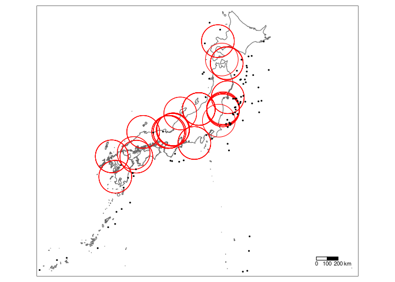

津波による原子力発電所事故の危険性調査
================
宮本 周
6月30日

-   [0. 要旨](#0-要旨)
-   [1. はじめに](#1-はじめに)
    -   [1.1 背景](#11-背景)
    -   [1.2 目的](#12-目的)
-   [2. 手法](#2-手法)
-   [3. データ](#3-データ)
-   [4. 結果](#4-結果)
-   [5. 考察](#5-考察)
-   [6. 結論](#6-結論)
-   [7. Graphic Abstract](#7-graphic-abstract)
-   [8. 参考文献](#8-参考文献)

## 0. 要旨

東日本大震災で発生した津波の影響により、福島第一原子力発電所で事故が発生し、大きな影響を及ぼした。本論文では福島第一原子力発電所と同様の事故を起こす危険性がある原子力発電所があるかまた、危険性の少ない原子力発電所はあるかを地理情報データを用いて調査し、考察を行った。

   

## 1. はじめに

### 1.1 背景

3月11日に起こった東日本大震災により福島第一原子力発電所で事故が発生した。事故の発生原因は津波だった。2020年現在でも帰還困難地域が存在する([福島民有新聞
2020-09-21](#ref-Evacuation))など、長きにわたり大きな問題となっている。しかし、世界に目を向けるとフランスでは原子力発電所を盛んに利用しており、全体の75%([JAEA
2017-01](#ref-electro))を占めるほどである。フランスでは人が揺れを感じる程の地震は僅かしか発生しておらず([夕刊フジ
2019-11-22](#ref-France))、津波による被害を懸念する必要がないので、原子力発電所を利用できている。

### 1.2 目的

本論文では、福島第一原子力発電所と同じ事故が発生する可能性を持っている原子力発電所はあるか、また津波の被害から安全に利用可能と想定される原子力発電所はあるかについて実験し、日本で原子力発電所を利用する危険性と安全に原子力発電所を利用できる地域を調査する。

## 2. 手法

現在設置されている原子力発電所の位置データと過去に起こった地震の震源の位置データを地図上にプロットし、津波の被害を受ける可能性のある原子力発電所を調べる。

## 3. データ

現在設置されている原子力発電所の位置データを国土交通省のHP([国土交通省,
n.d.](#ref-nuclear))より取得した。
加えて、日本で地震の計測が始まった1912年から現在までの過去110年に起こった地震の震源位置データをUSGS([USGS,
n.d.](#ref-USGS))から取得した。ただし、今回利用する震源位置データは被害を起こす可能性のある津波の発生条件である震度7以上かつ深さ40km以内([高知市,
n.d.](#ref-earthquake))で発生した地震の震源のみとする。福島第一原子力発電所と東日本大震災の震源地までの距離以内の位置を危険位置とする。

## 4. 結果

プロット結果を\#\#7.
に記載する。黒い点が地震の震源であり、赤い円が原子力発電所の位置を中心として津波によって原子力発電所に被害が発生する可能性を含む範囲を示す。

## 5. 考察

図から、ほとんどの赤い円の中に地震の震源があり、津波による原子力発電所に被害が発生する可能性が高いとみられる。ただ、志賀原子力発電所と大間原子力発電所は円の中に震源が存在していないことがわかった。そのため、この二つの原子力発電所は今後地震が発生したときに津波の被害を受ける可能性が低いと予想される。

## 6. 結論

現在日本で設置されている原子力発電所のほとんどは福島第一原子力発電所と同様の事故を起こす可能性が高く、撤去することを薦める。しかし、志賀原子力発電所と大間原子力発電所に関しては事故が発生する可能性が低いとみられるため、今後も稼働し続けて問題ない。

## 7. Graphic Abstract

<!-- -->

## 8. 参考文献

JAEA. 2017-01. “フランスの原子力発電所分布地図.”

USGS. n.d. “Search Earthquake Catalog.”
*Https://Earthquake.usgs.gov/Earthquakes/Search/*.

国土交通省. n.d. “国土数値情報ダウンロードサービス.”
*Https://Nlftp.mlit.go.jp/Ksj/Jpgis/Datalist/KsjTmplt-P03.html*.

夕刊フジ. 2019-11-22.
“フランス南部で１６年ぶり「大地震」も日本では…　原発耐震基準の「想定外」とは.”
*Https://Www.zakzak.co.jp/Soc/News/191122/Dom1911220004-N1.html\#: :text=フランスでは年間に約,は大違いなのだ。*.

福島民有新聞. 2020-09-21.
“【避難指示区域】「帰還困難」「居住制限」「避難指示解除準備」区域.”
*Https://Www.minyu-Net.com/News/Sinsai/Saihen.php\#: :text=政府は3月31日,帰還困難区域が残る。*.

高知市. n.d. “地震に関する一般的な知識.”
*Https://Www.city.kochi.kochi.jp/Soshiki/12/Nankaiippann.html*.

